# Flowsheet Inspector

[Provide feedback, request features, and report bugs.](https://github.com/prommis/flowsheet-inspector/issues)

<h2 id='requirement'>About</h2>

Flowsheet Inspector is an all-in-one VS Code extension that helps you run and inspect [IDAES](https://idaes.org/), [PrOMMiS](https://netl.doe.gov/prommis), and [WaterTAP](https://www.nawihub.org/knowledge/watertap/) chemical process flowsheets without leaving the editor.

<h2 id='requirement'>Requirements</h2>

This extension require another python cli tool called `flowsheet-inspector-lib` to run.

[Flowhseet Inspector Lib source code on Github](https://github.com/prommis/flowsheet-inspector-lib)  

To install, make sure you have python 3.12+ installed and run:
```bash
pip install git+https://github.com/prommis/flowsheet-inspector-lib.git
```

## Wrap a flowsheet  
To run your flowsheet, you first need to wrap it.  

### Why do you need to wrap? 
- The `Flowsheet Inspector` VS Code extension depends on `flowsheet-inspector-lib` to run your flowsheet behind the scenes. The library executes your flowsheet step by step, so it needs to know which functions in your script are steps. To tell it, import `FlowsheetRunner`, create a module-level instance (for example `FS = FlowsheetRunner()`), and add the `@FS.step("<step name>")` decorator above each step function. This is what "wrapping" a flowsheet means.

### How to wrap:
- You can wrap your flowsheet manually.
- You can use the extension's [built-in code snippet to insert a wrapped flowsheet template](#snippet) as a starting point, or to learn how to wrap a flowsheet.
- You can use our [PSE-Skills](https://github.com/prommis/pse-skills) to have AI help you wrap your flowsheet.

## Features

- Before a run:
    - [Select one or more steps to run only part of a flowsheet.](#steps)
    - [Load and review the run history of a flowsheet.](#history)
    - [Select the Python interpreter used to run your flowsheet.](#interpreter)
- While editing:
    - [Insert a flowsheet template with a snippet.](#snippet)
- After a run:
    - [Review the resulting flowsheet diagram.](#diagram)
    - [Review the stream table and the variables used in the flowsheet.](#stream_variable)
    - [Review the Diagnostics Toolbox results.](#diagnostic)
    - [Review the IPOPT solver output.](#ipopt)
    - [Review the flowsheet run logs.](#log)

## Before a run

1. <h3 id='steps'>Select one or more steps to run only part of a flowsheet</h3>

    The step selector is a draggable vertical selector bar, which allows you to select which steps you would like to run.

    - *Steps are defined in your flowsheet with the Python decorator `@FS.substep(base:str, name:str)`.*  
    - *If no step is selected, clicking Run will run all steps by default.*

    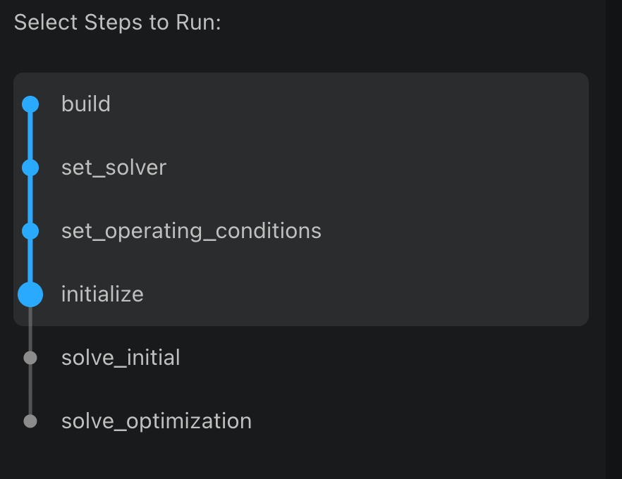

1. <h3 id='history'>Load and review the run history of a flowsheet</h3>

    - There are two tabs at the very top of the control panel. To review previous run result, click on the History tab.
    - To find a specific run, type keywords in search bar to search.
    - Click on one row of history will render that flowsheet result to screen.

    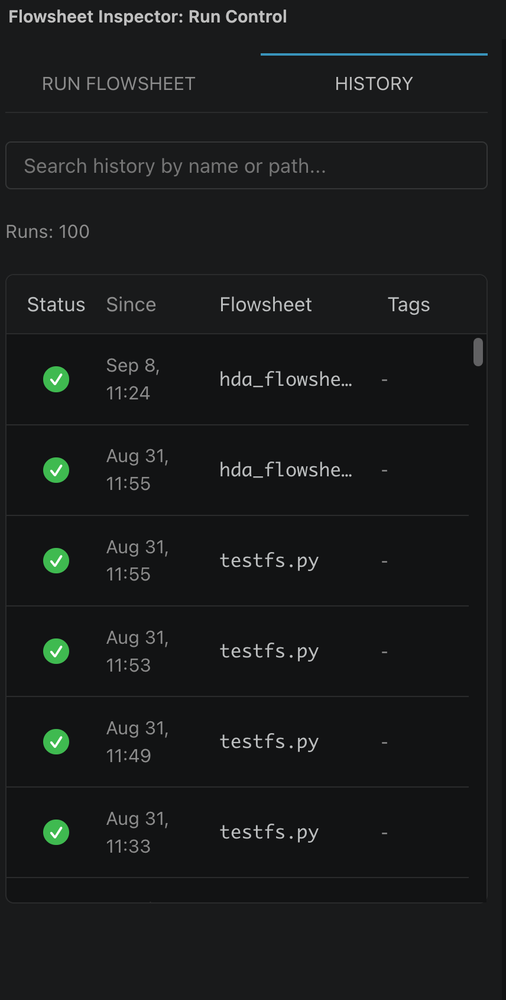

1.  <h3 id='interpreter'>Select the Python interpreter used to run your flowsheet</h3>
    - The Python interpreter selector is located in the control panel. It controls which Python interpreter (environment) is used to run current flowsheet.
    - If Microsoft's Python extension is installed, it uses that extension's API to read the interpreter you selected there. Otherwise, it uses the interpreter you picked in the Flowsheet Inspector picker (which lists conda environments, workspace virtual environments, and interpreters on your PATH), or, if you have not picked one yet, the conda environment VS Code was launched from.
    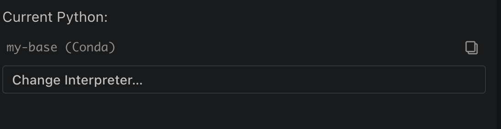

    - The selected Python interpreter's name is shown on the left, above the Change Interpreter button. Clicking the copy button copies the current interpreter name to your clipboard.
    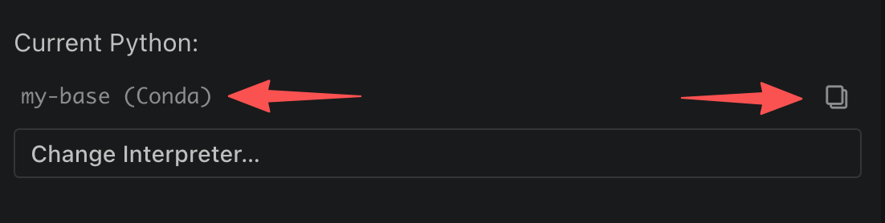

    - To change the interpreter, click the Change Interpreter button. A list of environments will appear on your screen; select the one you need.
    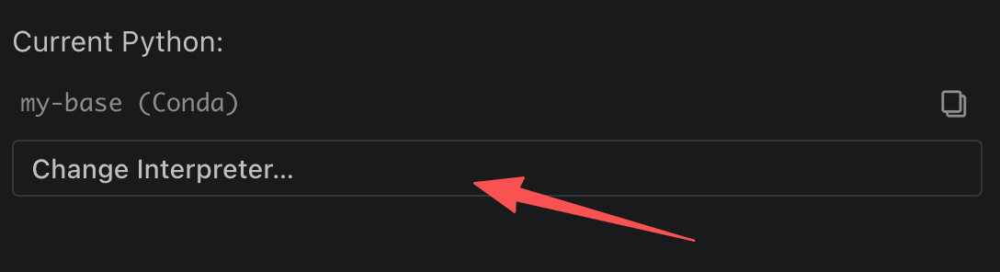
    - ENV list:
    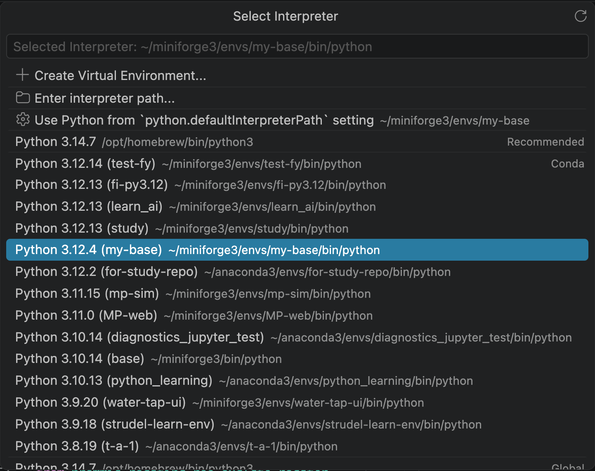
## While editing

1.  <h3 id='snippet'>Insert a flowsheet template with a snippet</h3>

    - The flowsheet template is available as a code snippet. To use it, type `flowsheet:idaes` in a Python file and the flowsheet template will appear in your VS Code editor.

    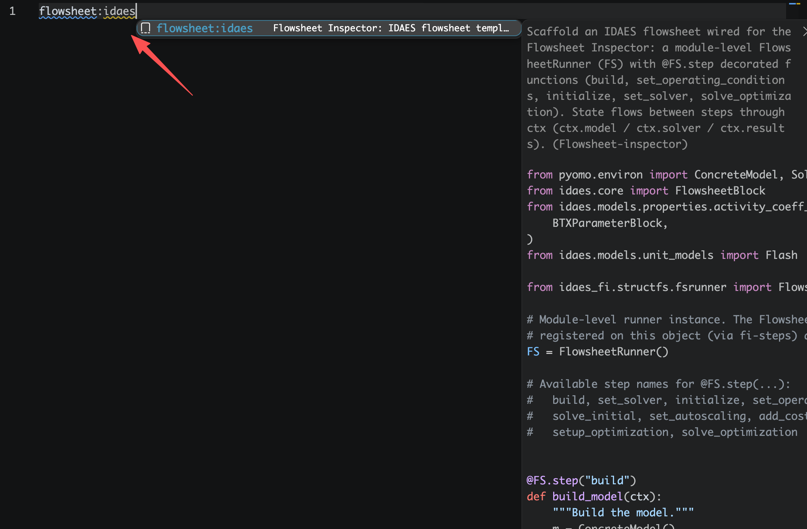
## After a run

1.  <h3 id='diagram'>Review the resulting flowsheet diagram</h3>
    - After a run, Flowsheet Inspector brings up the result panel. The first tab is Diagram, which uses Mermaid to render a diagram of the flowsheet's unit components and their connections to help you visualize the flowsheet.
    
    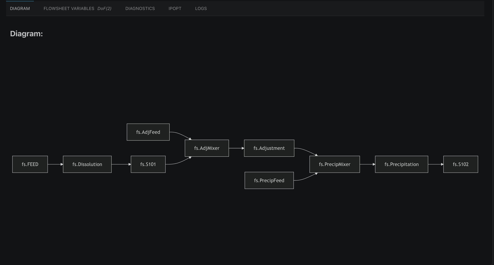

1.  <h3 id='stream_variable'>Review the stream table and the variables used in the flowsheet</h3>

    - The Flowsheet Variable tab is the second tab of the result panel. Clicking the tab switches to that view.
    - The view contains two sections: `table view` and `variable tree view`. Click on `View variable tree` radio button which is located on the right side of the search bar to switch between these views. 
    
    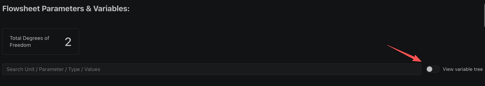

    - The table view contains a `stream table` and a `variable table`. Type keywords in the search bar to search for a variable or a specific value.

    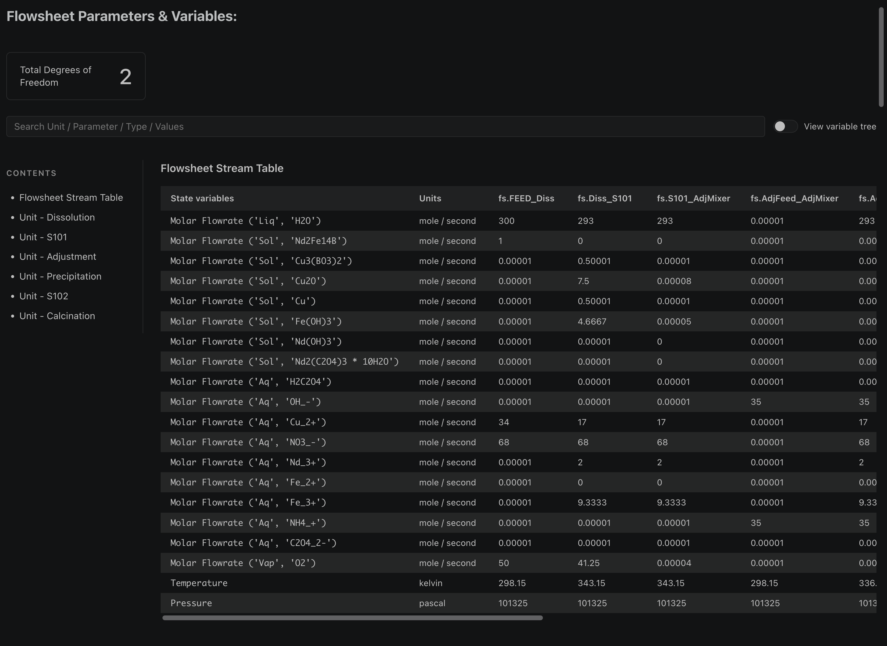

    - Once you click the radio button and switch to the variable view, all variables are shown on the screen as a collapsed tree, similar to a file system tree. As in the table view, you can type keywords in the search bar to search for a variable or a specific value.

    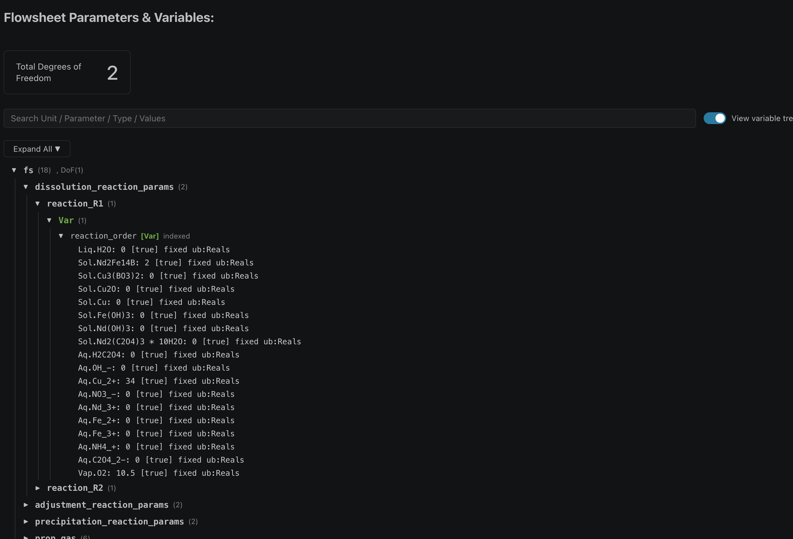

1.  <h3 id='diagnostic'>Review the Diagnostics Toolbox results</h3>

    - The third tab is the Diagnostics result view. The `Diagnostics Toolbox` is a built-in IDAES tool. It used to require you to manually write function calls in your script to trigger it, but Flowsheet Inspector runs it for you automatically, so you only need to review the results.

    - The diagnostics view contains two tabs, `Structure Issue` and `Numerical Issue`. Click a tab to switch views and review the corresponding output.

    - Click `Expand All` or `Collapse All` to expand or collapse all foldable sections, which helps you navigate the tree structure.

    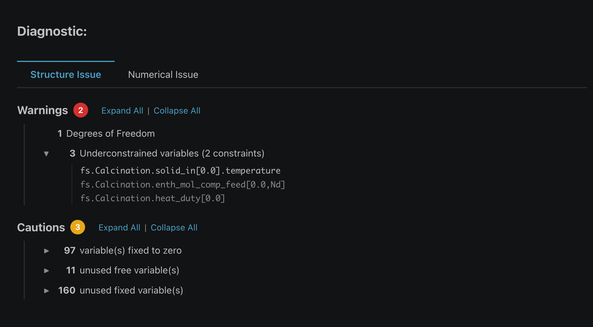

1.  <h3 id='ipopt'>Review the IPOPT solver output</h3>

    - The fourth tab IPOPT view, Flowsheet inspector will run the IPOPT solver and out put solver result to screen while you running your flowsheet.

    - There are two tabs represent two stage of solver output you can find on the screen, they are `Initial Solver Output` and `Optimization Solver Output`. Click on each one will bring up the dedicated result view to screen.

    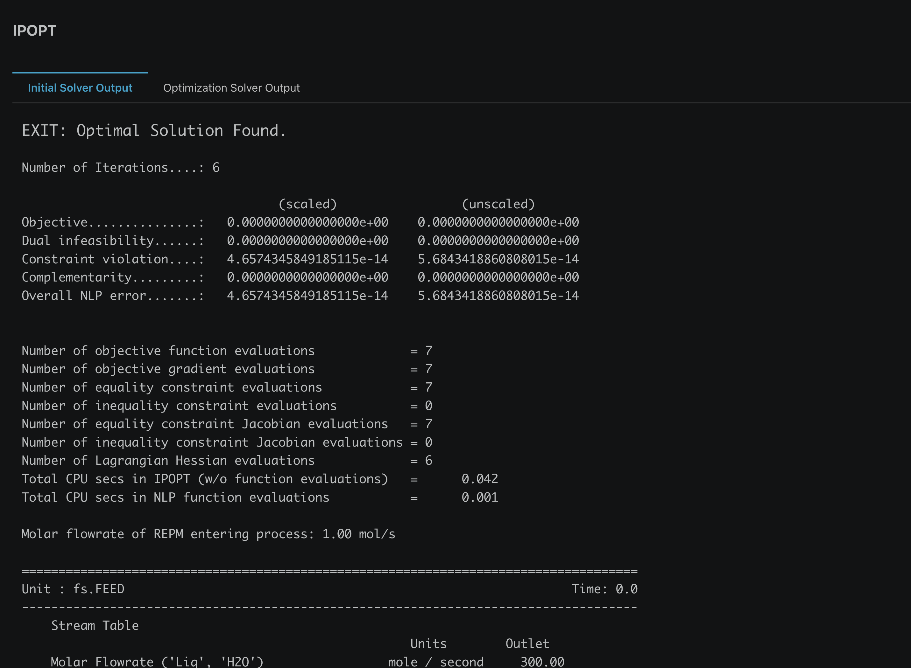

1.  <h3 id='log'>Review the flowsheet run logs</h3>

    - The last tab is the Logs tab. Because the extension runs your flowsheet through `flowsheet-inspector-lib` in a Node.js subprocess behind the scenes, its output is invisible by default. This panel captures all of the subprocess's output logs and displays them on screen for you.

    - There are two tabs in this panel: `Error Log` and `Terminal Logs`.
    - `Error Log` filters the output for errors and displays the error messages with clickable links on screen. (Click a link to open the file at the line of code that caused the error.)
    
    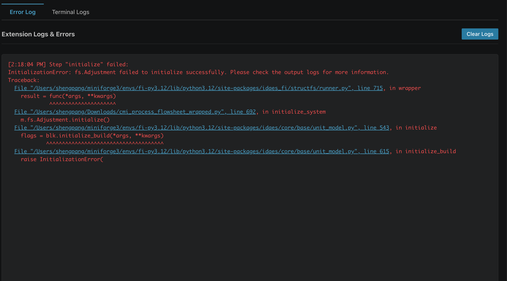 

    - `Terminal Logs` works just like the regular terminal you use during development. It captures all of the subprocess's terminal output and displays it to you live.
    
    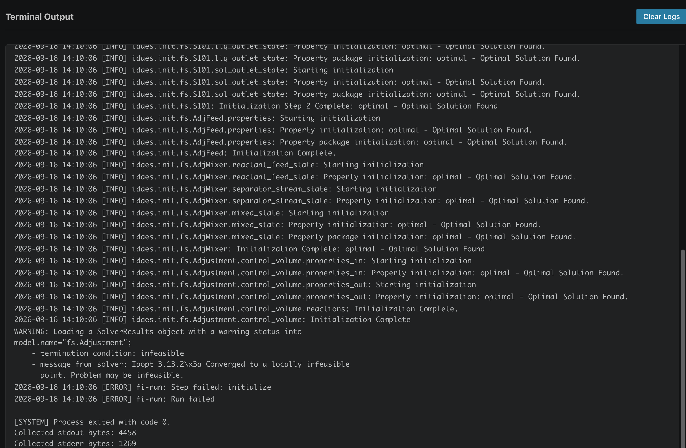